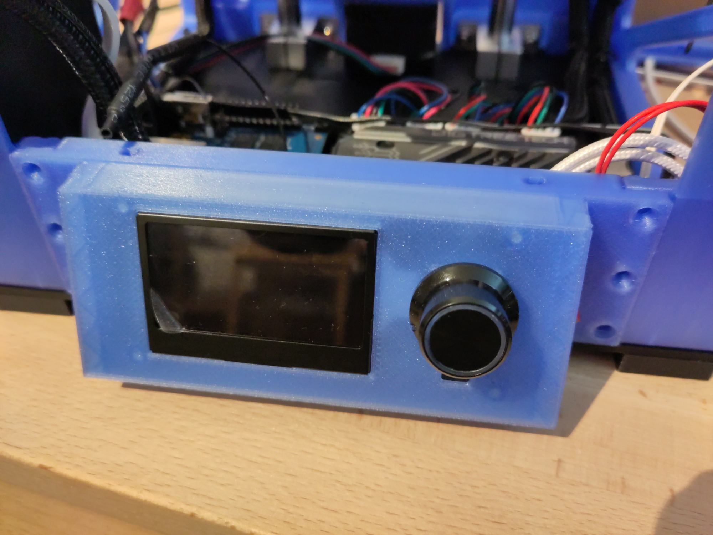
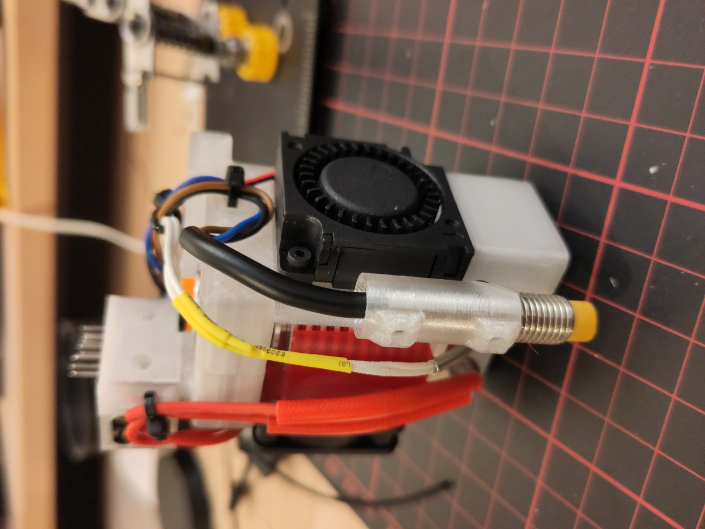
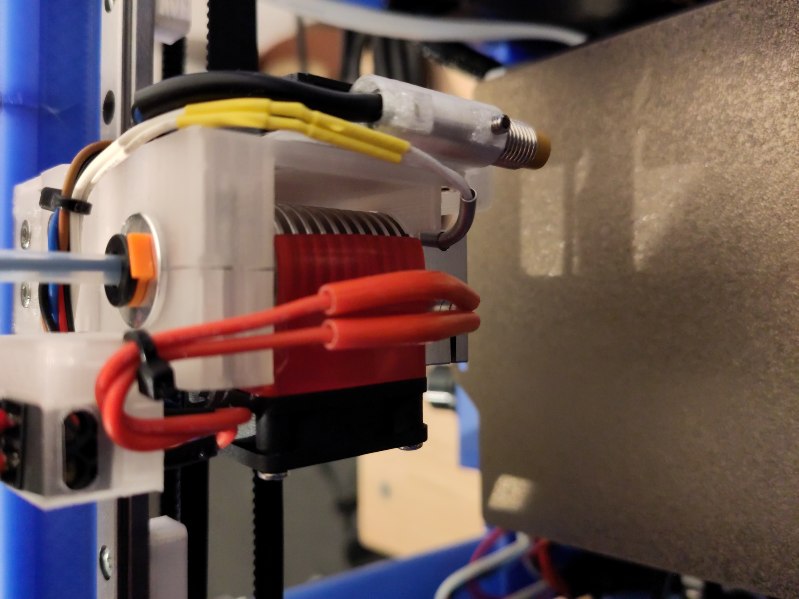
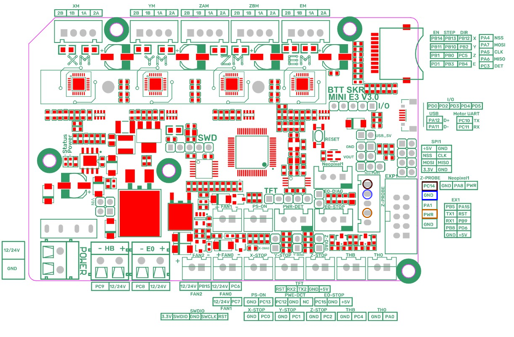

# Notes

## Mini12864 Holder
- Side Switch available for switching Wifi between Client and AP Mode
- Switch Size: 12,5 x 19 mm (0,49 "x 0,75" (L * B)
- STL also available without the switch on the side

## Pinda Holder for BabyCube
__!! ATTENTION !!__

If you install the Pinda Probe make sure that when probing the Endstop of the Z-Axes, the Probe should be moved over the bed.
In default position (x=left, y=0 at the front), the Pinda is not over the Build Plate and thus will not detect the bed. This will move the nozzle into the bed when probing.

I used the __BTT SKR Mini E3 v3__ board and connected the Pinda to the Z-Probe Connector. See Image (not my image)...

